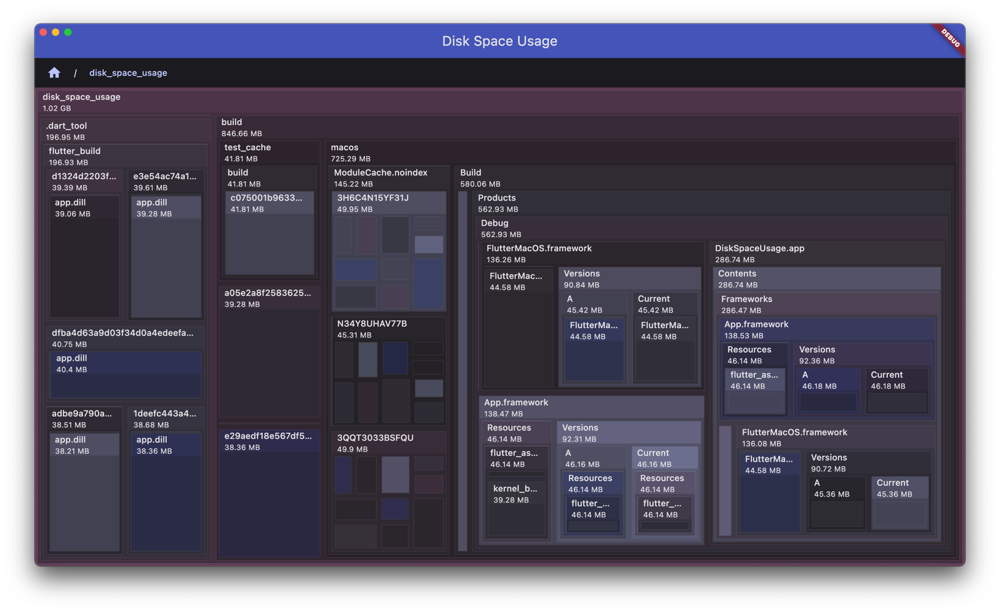

# Disk Space Usage

This is a small desktop app that will allow you to analyze
the disk space usage of a given directory of your choosing.

It's built in [Dart](https://dart.dev) using [Flutter](https://flutter.dev/).

It can be built for Windows, Linux and MacOS.

## Screenshot



## Running checks

This will run tests, check for cyclic dependencies and verify formatting.

```
make check
```

## Formatting

We use a line length of `100` characters, which is good enough to show two files side by side on a modern 27-inch
screen.
Line length can be set in Jetbrains IDEs `Preferences > Editor > Code Style > Dart`.

If your prefer a different line length, feel free to update the `disk_spaces_usage/Tasks.mk` to your team's liking
and have developers configure their IDE as well.

## Cyclic dependencies

Make sure your imports are relative only for files in the same folder, otherwise use `package:` imports.
